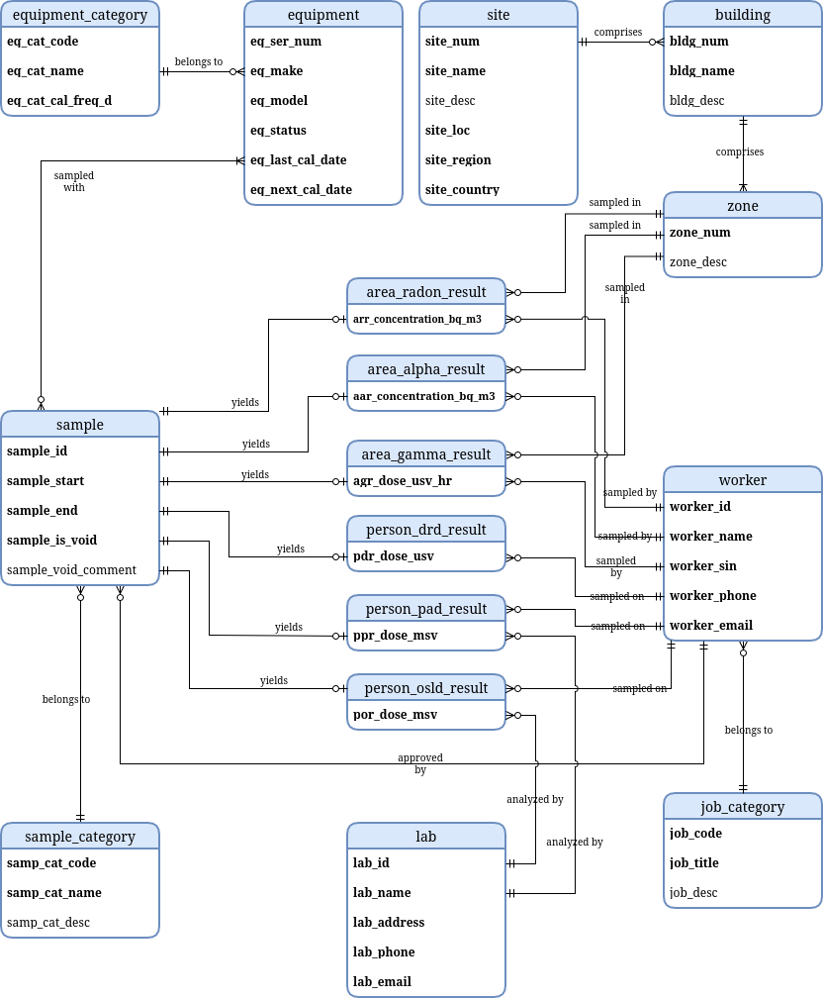
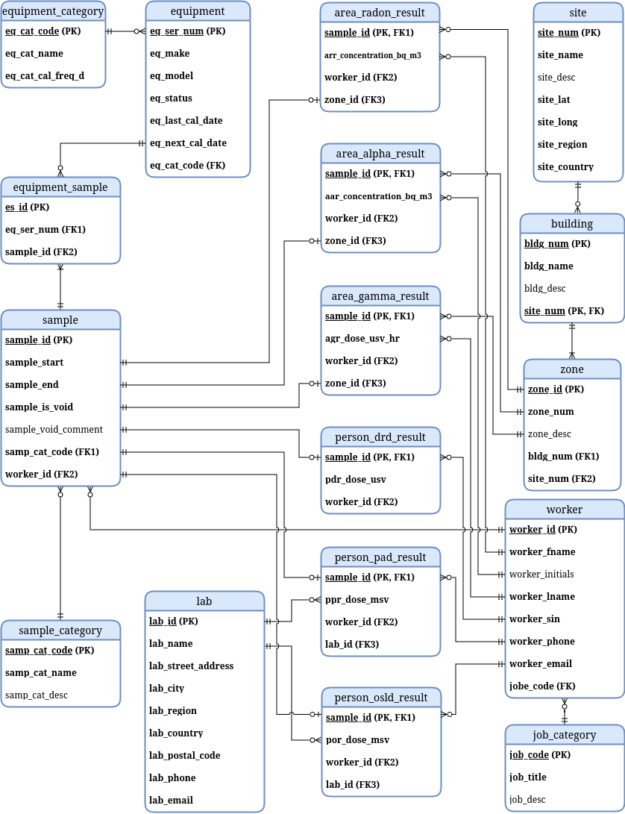
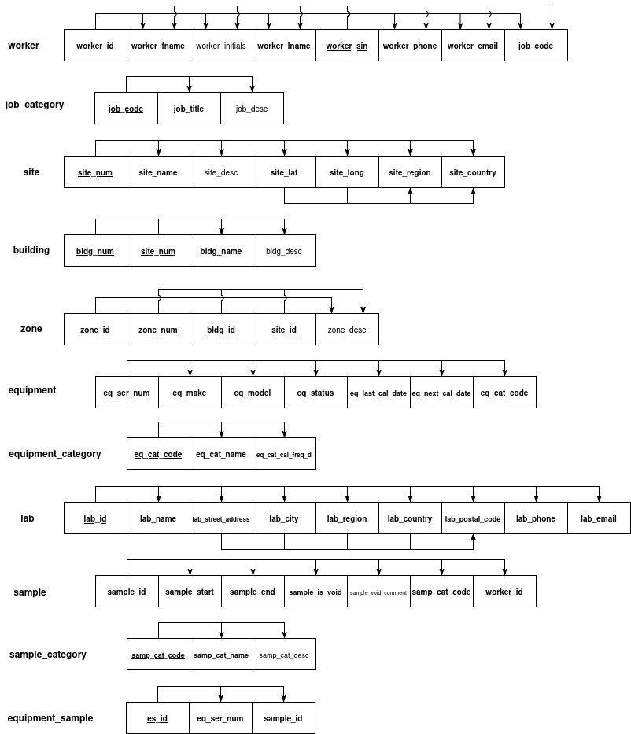
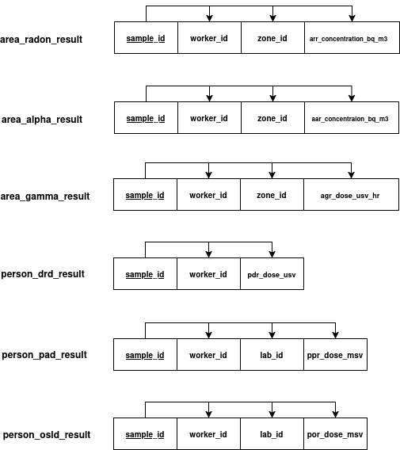

# A Relational Database for Radiation Protection in Uranium Mining

## Table of Contents

- [Introduction](#introduction)
- [Business Rules](#business%20rules)
- [Conceptual Database Design Model](#conceptual%20database%20design%20model)
- [Logical Database Design Model](#logical%20database%20design%20model)
- [Normalization](#normalization)

## Introduction

Uranium is a common element found throughout Earth's crust. Uranium is mined to be used as fuel in nuclear power plants. Canada, particularly Saskatchewan, has some of the world's largest uranium deposits. In Saskatchewan, there are several active and planned uranium mines.

Compared to other types of mining, uranium mining presents additional challenges as uranium is radioactive. Two types of radioactivity are of chief concern in uranium mining. The first is alpha emission. In alpha emission, a radioactive atomic nucleus (the parent) emits a helium-4 nucleus (a bound state of two protons and two neutrons often called an alpha ray), transforming into a nucleus of a different element (the progeny). The second is gamma emission. In gamma emission, a radioactive substance emits high-frequency, short-wavelength electromagnetic radiation (often called gamma rays).

Material exposed to radiation absorbs energy from the radiation. Radiation dose is a measure of energy absorbed per mass. Large radiation doses in human tissue or bone are a significant health risk as they can cause radiation sickness, burns, and an increased likelihood of cancer. 

Alpha rays generally have relatively low penetrating power and are easily blocked by shielding such as a sheet of paper or a person's epidermis (outer layer of skin). As such, alpha radiation is regarded as an internal, not external, radiation hazard: an alpha emitter is dangerous mainly if it enters the body through inhalation, ingestion, or through a wound. In contrast, gamma radiation has relatively high penetrating power and cannot be completely blocked by shielding. Gamma rays are both an internal and external radiation hazard.

Yet another radiation-related concern in uranium mining is the release of radon gas. Uranium-238 (the principal component of uranium in Earth's crust) decays naturally via a sequence of radiation emissions (including several alpha emissions). Among the progeny of these decays is radon-222, a colourless, odourless, chemically-inert gas. Radon-222 is an alpha emitter, but perhaps of greater significance, being an inert gas, it easily disperses throughout the environment spreading radioactivity.   

The goals of radiation protection are to prevent both workers and the general public from absorbing unsafe radiation doses and to prevent environmental contamination with radioactive material. To achieve these goals, radiation-protection practitioners at uranium mines regularly test workers for absorbed doses from alpha and gamma radiation, and they test areas within mine sites for concentration of radioactive material, including radon-222. These tests yield a large amount of data to be stored and analyzed. Furthermore, regular radiation-safety reports must be issued to workers, managers, and various government agencies. In what follows, we design and implement a relational database intended for use in radiation protection at uranium mines.

## Business Rules

The business rules that guide the database design are as follows:

- Each worker has the following attributes: ID, name, social insurance number (SIN) which is generally required by federal regulatory agencies, phone number, and email address. Also, each worker belongs to precisely one job category characterized by a job code, a title (*e.g.,* miner, radiation technician, or radiation safety officer (RSO)), and a job description. There are zero or more workers per job.
- There are one or more mining sites. Each mining site comprises zero or more buildings. Each building comprises one or more zones. Mining sites are characterized by a number, a name, a description, a location (*i.e.,* latitude and longitude), a region (*e.g.,* Saskatchewan), and a country (*e.g.,* Canada). Buildings are characterized by a number (starting at 1 for each site), a name, and a description. Zones are characterized by a number (starting at 1 for each building) and a description.
- Many pieces of equipment are used in radiation safety at uranium mines. Data that needs to be tracked for each piece of equipment are a serial number, a make, a model, a status (*i.e.,* ready, deployed, out of service, or retired), a last-calibration date, and a next-calibration date. Also, each piece of equipment belongs to precisely one category, and each category contains zero or more pieces of equipment. Each equipment category has a code, a name (*e.g.,* air pump, alpha counter, gamma meter, optically-stimulated luminescent dosimeter (OSLD), personal alpha dosimeter (PAD), or direct-reading dosimeter (DRD)), a description, and a recommended calibration frequency (in days).
- Once used in the field, certain types of equipment (namely OSLDs and PADs) need to be shipped to an external lab for analysis. A lab is characterized by an ID, a name, a shipping address, a phone number, and an email address.
- Radiation monitoring is done for both areas and persons through the collection and analysis of samples. All samples, whether area samples or person samples, have a sample number, a start datetime, and an end datetime. Also, each sample must be approved by an RSO. Furthermore, a sample can be declared void; if this occurs, a reason should be given. Each sample is sampled using one or more pieces of equipment, and each piece of equipment can be used to take zero or more samples. Each sample belongs to precisely one sample category, and each sample category contains zero or more samples. Each sample category has a code, a name (*i.e.,* area radon gas, area alpha, area gamma, person PAD, person DRD, or person OSLD), and a description.
- For each sample, there is a result. However, the attributes of a result depend on the sample's category. 
    - Each area-sample result refers to precisely one zone, and each zone serves as the location for zero or more area-sample results. Each area sample is sampled by a worker who is either a radiation technician or an RSO. Each worker permitted to sample areas does so zero or more times. 
    - Each person-sample result is sampled on precisely one worker, and each worker gets sampled for zero or more person-sample results.
    - Each result corresponding to a person PAD or a person OSLD is obtained from an analysis performed at an external lab. Each external lab can perform many analyses.
    - For area radon gas, results represent radon gas concentration in Becquerels (Bq) per cubic metre (m^3). (Note that 1 Bq corresponds to 1 radioactive decay per second.) Collecting an area-radon-gas sample requires an air pump and an alpha counter. 
    - For area alpha, results represent alpha-emitter concentration in Bq/m^3. Collecting an area-alpha sample also requires an air pump and an alpha counter.
    - For area gamma, results represent dose rate in microsieverts (uSv) per hour. (Note that sieverts have the same dimensions as Joules per kilogram and serve as a unit of measure of expected biological damage from absorbed radiation.) Area-gamma samples are collected using a gamma meter.
    - For person PAD, results represent dose from alpha rays in mSv. Person-PAD samples are collected using PADs.
    - For person DRD, results represent dose from gamma rays in uSv. Person-DRD samples are collected using DRDs.
    - For person OSLD, results represent dose from gamma rays in mSv. Person-OSLD samples are collected using OSLDs.

## Conceptual Database Design Model

The following figure depicts the database design at a conceptual level, implementing the business rules discussed above. In particular, entities, attributes, and relationships have been defined. It is worth noting that, rather than a single table for samples and their corresponding results, multiple tables are used instead. The attributes of the sample table are those pieces of data common to all samples, regardless of category (*e.g.,* OSLD, PAD, area radon, *etc...*). Each sample belongs to a sample category, and each sample category has its own corresponding result table related to sample through a 1:1 relationship where a sample is mandatory but a result is optional. (For instance, a PAD sample will have a corresponding row in the area_pad_result table but not in, say, the aar_concentration_bq_m3 table.) This structure minimizes repetition and NULL entries. Furthermore, it can be easily extended to accommodate new sample categories without requiring that existing tables be altered.

## Logical Database Design Model

The following figure depicts the database design at a logical level. In particular, primary Keys (PKs) and foreign keys (FKs) have been clearly defined. Also, a bridging table has been introduced in order to implement the many-to-many relationship between the equipment and sample tables.

## Normalization

From the normalization diagrams shown below, it can be seen that all tables except site and lab are BCNF. The site and lab tables are 2NF, but not 3NF as both tables contain one or more transitive dependencies. For the site table, site_region and site_country can be thought of as functions of site_lat and site_long. Similarly, for the lab table, lab_postal_code can be thought of as a function of lab_street_address, lab_city, and lab_region. However, separate lookup tables implementing these relationships seems unnecessary. Both the site and lab tables will likely contain only a few entries and no repeated latitude and longitude coordinates and/or postal codes. As such, two new lookup tables would not lead to a decrease in data repetition, just a more complicated schema. For this reason, the site and lab tables are left in 2NF form. 

Note that the worker and zone tables each have a primary key (PK) as well as a second candidate key. For the worker table, worker_id is the PK whereas worker_sin (SIN) is an additional candidate key. For the zone table, zone_id is a surrogate PK, helpful for joins that involve this table. The triple (site_num, bldg_num, zone_num) is a (hierarchical) candidate key.

## Database Implementation and Operation

- setup
- create daily and monthly reports summarizing RnP, RnG (active) area monitoring
- create cumulative monthly, quarterly, annual RnP doses for each worker

## Discussion

Future improvements:
- equipment calibration logs
- lab shipping logs
- timecards
- worker promotions, *i.e.,* changes in job title
- worker-dosimeter assigning and tracking
- triggers

## Conclusion

## Acknowledgements

- prof
- Marty

## References

- health physics book
- Marty
- draw.io