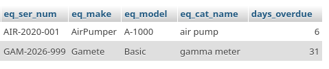
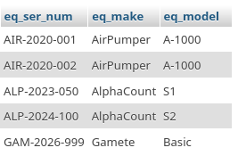
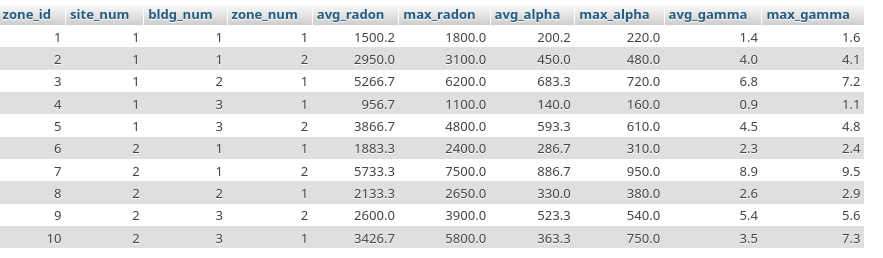
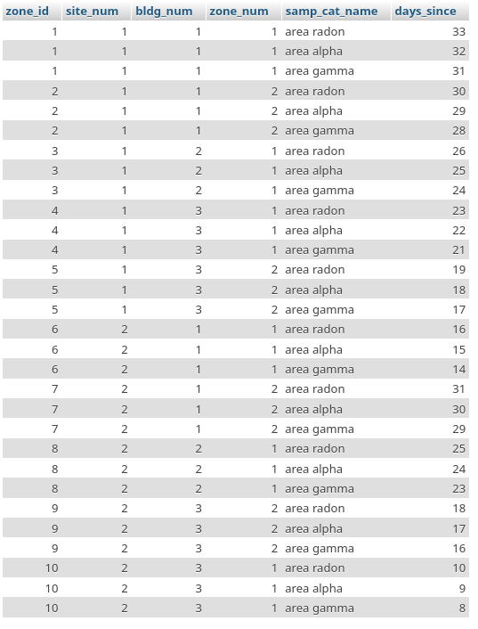
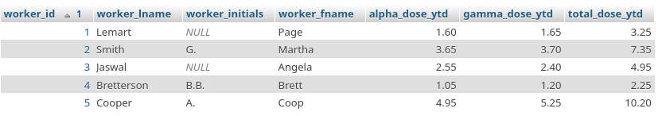

# A Relational Database for Radiation Protection in Uranium Mining

## Table of Contents

- [Introduction](#introduction)
- [Business Rules](#business%20rules)
- [Conceptual Database Design Model](#conceptual%20database%20design%20model)
- [Logical Database Design Model](#logical%20database%20design%20model)
- [Normalization](#normalization)
- [Database Implementation and Operation](#database%20implementation%20and%20operation)
- [Discussion and Conclusions](#discussion%20and%20conclusions)
- [Acknowledgements](#acknowledgements)

## Introduction

Uranium is a common element found throughout Earth's crust. Uranium is mined to be used as fuel in nuclear power plants. Canada, particularly Saskatchewan, has some of the world's largest uranium deposits. In Saskatchewan, there are several active and planned uranium mines.

Compared to other types of mining, uranium mining presents additional challenges as uranium is radioactive. Two types of radioactivity are of chief concern in uranium mining. The first is alpha emission. In alpha emission, a radioactive atomic nucleus (the parent) emits a helium-4 nucleus (a bound state of two protons and two neutrons often called an alpha ray), transforming into a nucleus of a different element (the progeny). The second is gamma emission. In gamma emission, a radioactive substance emits high-frequency, short-wavelength electromagnetic radiation (often called gamma rays).

Material exposed to radiation absorbs energy from the radiation. Radiation dose is a measure of energy absorbed per mass. Large radiation doses in human tissue or bone are a significant health risk as they can cause radiation sickness, burns, and an increased likelihood of cancer. 

Alpha rays generally have relatively low penetrating power and are easily blocked by shielding such as a sheet of paper or a person's epidermis (outer layer of skin). As such, alpha radiation is regarded as an internal, not external, radiation hazard: an alpha emitter is dangerous mainly if it enters the body through inhalation, ingestion, or through a wound. In contrast, gamma radiation has relatively high penetrating power and cannot be completely blocked by shielding. Gamma rays are both an internal and external radiation hazard.

Yet another radiation-related concern in uranium mining is the release of radon gas. Uranium-238 (the principal component of uranium in Earth's crust) decays naturally via a sequence of radiation emissions (including several alpha emissions). Among the progeny of these decays is radon-222, a colourless, odourless, chemically-inert gas. Radon-222 is an alpha emitter, but perhaps of greater significance, being an inert gas, it easily disperses throughout the environment spreading radioactivity.   

The goals of radiation protection are to prevent both workers and the general public from absorbing unsafe radiation doses and to prevent environmental contamination with radioactive material. To achieve these goals, radiation-protection practitioners at uranium mines regularly test workers for absorbed doses from alpha and gamma radiation, and they test areas within mine sites for concentration of radioactive material, including radon-222. These tests yield a large amount of data to be stored and analyzed. Furthermore, regular radiation-safety reports must be issued to workers, managers, and various government agencies. In what follows, we design and implement a relational database intended for use in radiation protection at uranium mines.

## Business Rules

The business rules that guide the database design are as follows:

- Each worker has the following attributes: ID, name, social insurance number (SIN) which is generally required by federal regulatory agencies, phone number, and email address. Also, each worker belongs to precisely one job category characterized by a job code, a title (*e.g.,* miner, radiation technician, or radiation safety officer (RSO)), and a job description. There are zero or more workers per job.
- There are one or more mining sites. Each mining site comprises zero or more buildings. Each building comprises one or more zones. Mining sites are characterized by a number, a name, a description, a location (*i.e.,* latitude and longitude), a region (*e.g.,* Saskatchewan), and a country (*e.g.,* Canada). Buildings are characterized by a number (starting at 1 for each site), a name, and a description. Zones are characterized by a number (starting at 1 for each building) and a description.
- Many pieces of equipment are used in radiation safety at uranium mines. Data that needs to be tracked for each piece of equipment are a serial number, a make, a model, a status (*i.e.,* ready, deployed, out of service, or retired), a last-calibration date, and a next-calibration date. Also, each piece of equipment belongs to precisely one category, and each category contains zero or more pieces of equipment. Each equipment category has a code, a name (*e.g.,* air pump, alpha counter, gamma meter, optically-stimulated luminescent dosimeter (OSLD), personal alpha dosimeter (PAD), or direct-reading dosimeter (DRD)), a description, and a recommended calibration frequency (in days).
- Once used in the field, certain types of equipment (namely OSLDs and PADs) need to be shipped to an external lab for analysis. A lab is characterized by an ID, a name, a shipping address, a phone number, and an email address.
- Radiation monitoring is done for both areas and persons through the collection and analysis of samples. All samples, whether area samples or person samples, have a sample number, a start datetime, and an end datetime. Also, each sample must be approved by an RSO. Furthermore, a sample can be declared void; if this occurs, a reason should be given. Each sample is sampled using one or more pieces of equipment, and each piece of equipment can be used to take zero or more samples. Each sample belongs to precisely one sample category, and each sample category contains zero or more samples. Each sample category has a code, a name (*i.e.,* area radon gas, area alpha, area gamma, person PAD, person DRD, or person OSLD), and a description.
- For each sample, there is a result. However, the attributes of a result depend on the sample's category. 
    - Each area-sample result refers to precisely one zone, and each zone serves as the location for zero or more area-sample results. Each area sample is sampled by a worker who is either a radiation technician or an RSO. Each worker permitted to sample areas does so zero or more times. 
    - Each person-sample result is sampled on precisely one worker, and each worker gets sampled for zero or more person-sample results.
    - Each result corresponding to a person PAD or a person OSLD is obtained from an analysis performed at an external lab. Each external lab can perform many analyses.
    - For area radon gas, results represent radon gas concentration in Becquerels (Bq) per cubic metre (m^3). (Note that 1 Bq corresponds to 1 radioactive decay per second.) Collecting an area-radon-gas sample requires an air pump and an alpha counter. 
    - For area alpha, results represent alpha-emitter concentration in Bq/m^3. Collecting an area-alpha sample also requires an air pump and an alpha counter.
    - For area gamma, results represent dose rate in microsieverts (uSv) per hour. (Note that sieverts have the same dimensions as Joules per kilogram and serve as a unit of measure of expected biological damage from absorbed radiation.) Area-gamma samples are collected using a gamma meter.
    - For person PAD, results represent dose from alpha rays in mSv. Person-PAD samples are collected using PADs.
    - For person DRD, results represent dose from gamma rays in uSv. Person-DRD samples are collected using DRDs.
    - For person OSLD, results represent dose from gamma rays in mSv. Person-OSLD samples are collected using OSLDs.

## Conceptual Database Design Model

The following figure depicts the database design at a conceptual level, implementing the business rules discussed above. In particular, entities, attributes, and relationships have been defined. It is worth noting that, rather than a single table for samples and their corresponding results, multiple tables are used instead. The attributes of the sample table are those pieces of data common to all samples, regardless of category (*e.g.,* OSLD, PAD, area radon, *etc...*). Each sample belongs to a sample category, and each sample category has its own corresponding result table related to sample through a 1:1 relationship where a sample is mandatory but a result is optional. (For instance, a PAD sample will have a corresponding row in the area_pad_result table but not in, say, the aar_concentration_bq_m3 table.) This structure minimizes repetition and NULL entries. Furthermore, it can be easily extended to accommodate new sample categories without requiring that existing tables be altered.


## Logical Database Design Model

The following figure depicts the database design at a logical level. In particular, primary Keys (PKs) and foreign keys (FKs) have been clearly defined. Also, a bridging table has been introduced in order to implement the many-to-many relationship between the equipment and sample tables.


## Normalization

From the normalization diagrams shown below, it can be seen that all tables except site and lab are BCNF. The site and lab tables are 2NF, but not 3NF as both tables contain one or more transitive dependencies. For the site table, site_region and site_country can be thought of as functions of site_lat and site_long. Similarly, for the lab table, lab_postal_code can be thought of as a function of lab_street_address, lab_city, and lab_region. However, separate lookup tables implementing these relationships seems unnecessary. Both the site and lab tables will likely contain only a few entries and no repeated latitude and longitude coordinates and/or postal codes. As such, two new lookup tables would not lead to a decrease in data repetition, just a more complicated schema. For this reason, the site and lab tables are left in 2NF form. 

Note that the worker and zone tables each have a primary key (PK) as well as a second candidate key. For the worker table, worker_id is the PK whereas worker_sin (SIN) is an additional candidate key. For the zone table, zone_id is a surrogate PK, helpful for joins that involve this table. The triple (site_num, bldg_num, zone_num) is a (hierarchical) candidate key.


## Database Implementation and Operation

This project is hosted at github at https://github.com/harnettd/radiation-protection-db.

In the topmost project directory of the repo is a bash script `setup.sh` which creates a database called `radiation_protection`. The script then runs three SQL scripts, each located in the `sql` directory:

- `create-tables.sql` creates the 17 tables of the logical database design model above.
- `insert-into-tables.sql` fills the 17 tables with a mix of fabricated and computer-generated random data.
- `create-views.sql` creates five views for reporting purposes. Each view is discussed in detail below.

The first view is a calibration report which identifies pieces of equipment that are overdue for calibration. The resulting report identifies the pieces of equipment in question and how many days overdue they are for calibration. The view is defined as

```sql
CREATE VIEW calibration_report AS
    SELECT
        eq_ser_num,
        eq_make,
        eq_model,
        eq_cat_name,
        ABS(DATEDIFF(eq_next_cal_date, CURRENT_DATE)) AS days_overdue
    FROM equipment JOIN
        equipment_category USING (eq_cat_code)
    WHERE DATEDIFF(eq_next_cal_date, CURRENT_DATE) < 0
    ORDER BY days_overdue, eq_cat_name;
```

and yields the following results:



The second view list pieces of equipment that were involved in one or more sample collections that were declared to be void. This report would be useful in tracking down potentially faulty equipment. The view is defined as 

```sql
CREATE VIEW void_equipment AS
    SELECT
        eq_ser_num,
        eq_make,
        eq_model
    FROM equipment
    WHERE eq_ser_num IN (
        SELECT DISTINCT eq_ser_num
        FROM sample JOIN
            equipment_sample USING (sample_id)
        WHERE sample_is_void = TRUE
        );
```

and yields the following results:



The third view provides summary statistics for each zone, namely average and maximum radon gas concentrations, alpha-emitter concentrations, and gamma dose rates. Zones are identified by both zone_id and a hierarchical triple: site_num, bldg_num, and zone_num. The view is defined as

```sql
CREATE VIEW area_summary AS
    SELECT
        COALESCE(arr.zone_id, aar.zone_id, agr.zone_id) AS zone_id,
        site_num, bldg_num, zone_num,
        ROUND(AVG(arr_concentration_bq_m3), 1) AS avg_radon,
        ROUND(MAX(arr_concentration_bq_m3), 1) AS max_radon,
        ROUND(AVG(aar_concentration_bq_m3), 1) AS avg_alpha,
        ROUND(MAX(aar_concentration_bq_m3), 1) AS max_alpha,
        ROUND(AVG(agr_dose_rate_usv_hr), 1) AS avg_gamma,
        ROUND(MAX(agr_dose_rate_usv_hr), 1) AS max_gamma
    FROM sample LEFT JOIN
        area_radon_result arr USING (sample_id) LEFT JOIN
        area_alpha_result aar USING (sample_id) LEFT JOIN
        area_gamma_result agr USING (sample_id) JOIN
        zone ON COALESCE(arr.zone_id, aar.zone_id, agr.zone_id) = zone.zone_id
    WHERE sample_is_void = FALSE AND
        samp_cat_code IN (1, 2, 3)
    GROUP BY 
        COALESCE(arr.zone_id, aar.zone_id, agr.zone_id)
    ORDER BY zone_id;
```

and yields the following results:



The fourth view reports the number of days that have passed since each zone was tested for each type of area sample: radon gas, alpha emitter, and gamma dose rate. Again, zones are identified by both a zone_id and a hierarchical triple. Zones are expected to be regularly tested for radioactivity, and this report would help managers plan future testing schedules. The view is defined as

```sql
CREATE VIEW area_frequency AS
    SELECT
        COALESCE(arr.zone_id, aar.zone_id, agr.zone_id) as zone_id,
        site_num, bldg_num, zone_num,
        samp_cat_name,
        MIN(DATEDIFF(CURRENT_DATE, DATE(sample_start))) AS days_since
    FROM sample LEFT JOIN
        area_radon_result arr USING (sample_id) LEFT JOIN
        area_alpha_result aar USING (sample_id) LEFT JOIN
        area_gamma_result agr USING (sample_id) JOIN
        sample_category USING (samp_cat_code) JOIN
        zone ON COALESCE(arr.zone_id, aar.zone_id, agr.zone_id) = zone.zone_id
    WHERE sample_is_void = FALSE
    GROUP BY COALESCE(arr.zone_id, aar.zone_id, agr.zone_id), samp_cat_code
    ORDER BY zone_id, samp_cat_code;
```

and yields the following results:



The fifth view is perhaps the most important. It produces a report listing each employee along with their year-to-date doses of alpha radiation as measured by PADs, gamma radiation as measured by OSLDs, and total radiation dose. This is the sort of report that would certainly need to be shared with the workers in question, their managers, and the federal government. The view is defined as

```sql
CREATE VIEW worker_does AS
    SELECT
        COALESCE(ppr.worker_id, por.worker_id) AS worker_id,
        worker_lname, worker_initials, worker_fname,
        ROUND(SUM(ppr_dose_msv), 2) AS alpha_dose_ytd,
        ROUND(SUM(por_dose_msv), 2) AS gamma_dose_ytd,
        ROUND(SUM(ppr_dose_msv) + SUM(por_dose_msv), 2) AS total_dose_ytd 
    FROM sample LEFT JOIN
        person_pad_result ppr USING (sample_id) LEFT JOIN
        person_osld_result por USING (sample_id) JOIN
        worker w ON COALESCE(ppr.worker_id, por.worker_id) = w.worker_id
    WHERE samp_cat_code IN (4, 5, 6) AND
        EXTRACT(YEAR FROM sample_start) = EXTRACT(YEAR FROM CURRENT_DATE)
    GROUP BY COALESCE(ppr.worker_id, por.worker_id)
    ORDER BY worker_id;
```

and yields the following results:



## Discussion and Conclusion

In this project, a relational database for radiation safety in uranium mining was designed, implemented, and tested beginning from a collection of business rules and ending with the definition of five views that would prove useful for radiation monitoring and reporting.

The database in question is best envisioned as part of a larger whole that would also address other business data needs related to, for instance, human resurces, inventory, uranium processing, sales, worker safety not related to radiation, *etc....*  

However, even when focusing exclusively on the radiation-safety aspects of uranium mining, there is much room for future improvements. For example,
- Equipment calibrations should be tracked in a calibration table noting, at the very least, calibration dates and calibration results.
- Sending and receiving PADs and OSLDs from external labs would generate data that should be stored including sending dates, receiving dates, and which pieces of equipment were included with each shipment.
- New equipment often needs to be purchased which requires vendors, orders, line items, *etc....* 
- Workers at uranium mines are often required to fill out time-cards each day. Using the time-card data combined with the area-samples, a radiation dose can be computed each day for each worker. This can ultimately be compared to results from PADs and OSLDs as a consistency check.
- Workers are assigned PADs and OSLDs on either a monthly or a quarterly basis. Sometimes workers lose their dosimeters. This possibility should somehow be accounted for in the database design.
- There are other sample categories typically considered in radiation safety such as radon progeny, long-lived radioactive dust, and urine bioassays. These categories and corresponding results tables should be added to the database.   
- There are some aspects of the business rules discussed above that are not readily implemented as either attribute or table constraints and might be better implemented as triggers. Examples include
    - When a sample is declared void, it should be mandatory to include a reason.
    - If a piece of equipment is issued to a worker, its status should generally change from ready to deployed.
    - All samples must be approved by a radiation safety office. All area samples must be sampled by a radiation technician or a radiation safety office.

The database discussed in this project was designed with flexibility and extensibility in mind and serves as a solid foundation for adding these and other features.

## Acknowledgements

Thanks to Dr. Ziaul Hossain for allowing me to enroll in COMP 230 at the University of the Fraser Valley. I learned a lot from the course. And thanks to Martin Lepage, a radiation safety officer at NexGen Energy Ltd., for many helpful discussions concerning radiation safety.